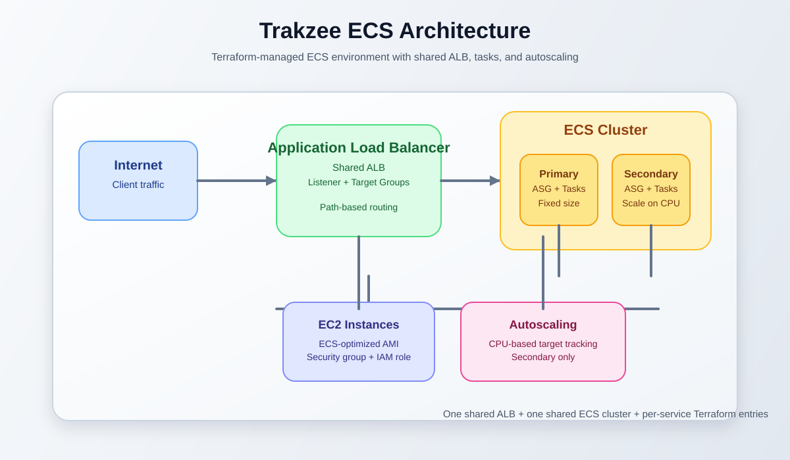
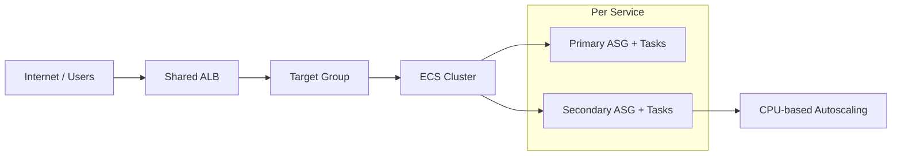

# Trakzee ECS Cluster - Infrastructure as Code

A Terraform-based ECS setup for Trakzee that packages the manual AWS infrastructure into a repeatable deployment model. The goal is simple: define a new microservice in one place, then let Terraform create the supporting ECS, ASG, ALB, and autoscaling resources automatically.

> This project is designed so you add a new service by editing only the `services` map in `terraform.tfvars`.

## Overview

This configuration creates a shared ECS cluster and shared ALB for the environment, then builds the resources needed for each service entry in the `services` map.

### What gets created for each service

- 2 launch templates: primary and secondary
- 2 auto scaling groups: primary (fixed at 1) and secondary (starts at 0)
- 2 ECS capacity providers: ECS managed scaling enabled
- 2 task definitions
- 2 ECS services sharing the same target group
- 1 ALB target group and 1 listener rule for path-based routing
- 1 Application Auto Scaling policy on the secondary service using CPU tracking

This gives you a clean pattern for scaling and routing multiple microservices behind a single ALB.

## Architecture diagram





## Why this setup exists

The infrastructure was originally created manually, but the pattern was repeated for each service. This Terraform version consolidates the common pieces into a reusable structure so the environment stays consistent and easier to manage.

The most important operational requirement is that EC2 instance security groups must allow traffic from the ALB on the ECS dynamic port range (`32768-65535`). This was a real production issue and can lead to failed health checks if not configured correctly.

## Prerequisites

The following resources must already exist before running this Terraform configuration:

- A VPC with subnets
- An EC2 instance security group that allows inbound TCP `32768-65535` from the ALB security group
- An ALB security group that allows inbound `80` and/or `443` from your traffic source
- An EC2 key pair
- An ECS-optimized AMI for your AWS region
- An IAM instance profile that includes the standard `AmazonEC2ContainerServiceforEC2Role` policy
- ECR repositories containing images tagged `:latest` for each service

## Quick start

```bash
cp terraform.tfvars.example terraform.tfvars
# Edit terraform.tfvars with your real VPC, subnet, security group, AMI, and key values

terraform init
terraform plan
terraform apply
```

## Adding a new microservice

Open `terraform.tfvars` and copy one block from inside the `services = { ... }` map. Rename the key, update the values, and then run the plan/apply steps again.

```bash
terraform plan
terraform apply
```

Terraform will only create the new service resources and will not modify existing infrastructure that is already running.

## Health check matcher note

Some services may return a `200` on their health checks, while others intentionally return `403` or another response. For example:

- VTS typically returns a clean `200`
- LiveTracking and Report may return `403` by design

Because of this, values such as `health_check_matcher = "200-499"` are sometimes required instead of a strict `"200"`. If a new service does not respond with a clean `200`, set the matcher accordingly instead of treating it as broken.

## Important operational notes

- This was not yet validated with `terraform validate` in this environment because the sandbox could not download the Terraform binary. Always run it before production use.
- The cluster default capacity provider strategy is based on map order, but all services here explicitly define their own strategy, so the risk is low.
- ASG `desired_capacity` is intentionally managed with `lifecycle { ignore_changes = [desired_capacity] }` so manual scaling or ECS managed scaling does not fight with Terraform updates.
- Autoscaling currently watches the secondary service CPU only; it does not scale based on the primary service load.
- Cost allocation tags follow the project convention `Project` / `Environment` / `Server_group` and may need to be adjusted if your team uses a different tagging standard.

## Project files

| File | Purpose |
|---|---|
| `variables.tf` | Input values, including the `services` map |
| `locals.tf` | Flattens and prepares service definitions |
| `provider.tf` | AWS provider configuration and Terraform version constraints |
| `cluster.tf` | ECS cluster and capacity provider wiring |
| `launch_templates.tf` | Launch templates for each service-role pair |
| `asg.tf` | ASGs and ECS capacity provider setup |
| `task_definitions.tf` | Task definitions and CloudWatch log groups |
| `alb.tf` | ALB, listener, target groups, and routing rules |
| `ecs_services.tf` | ECS service definitions |
| `autoscaling.tf` | Secondary autoscaling policies |
| `outputs.tf` | Useful output values such as the ALB DNS name |
| `terraform.tfvars.example` | Example values to copy into `terraform.tfvars` |

## Recommended next steps

1. Copy `terraform.tfvars.example` to `terraform.tfvars`.
2. Fill in your AWS values.
3. Run `terraform validate`.
4. Run `terraform plan` and review the infrastructure carefully.
5. Apply changes to AWS only after the plan looks correct.

---

# Trakzee Terraform
